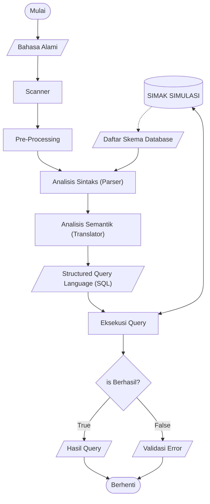

<h1 align=center>API UNSRIBOT</h1>

## FLOWCHART

```mermaid
flowchart TD;
    start([Mulai])
    inputNL[/Bahasa Alami/]
    ioSQL[/"Structured Query Language (SQL)"/]
    ioSchemaDB[/Daftar Skema Database/]
    outputQuery[/Hasil Query/]
    outputError[/Validasi Error/]
    scanner[Scanner]
    preProcessing[Pre-Processing]
    parser["Analisis Sintaks (Parser)"]
    translator["Analisis Semantik (Translator)"]
    execute[Eksekusi Query]
    isSuccess{is Berhasil?}
    stop([Berhenti])
    database[(SIMAK SIMULASI)]

    start-->inputNL;
    inputNL-->scanner;
    scanner-->preProcessing;
    preProcessing-->parser;
    parser-->translator;
    translator-->ioSQL;
    ioSQL-->execute;
    execute-->isSuccess;
    isSuccess-- True -->outputQuery;
    isSuccess-- False -->outputError;
    outputQuery-->stop;
    outputError-->stop;
    ioSchemaDB-->parser;
    database<-->execute
    database-.->ioSchemaDB;
```
